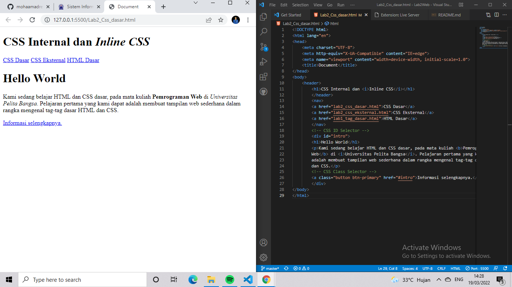
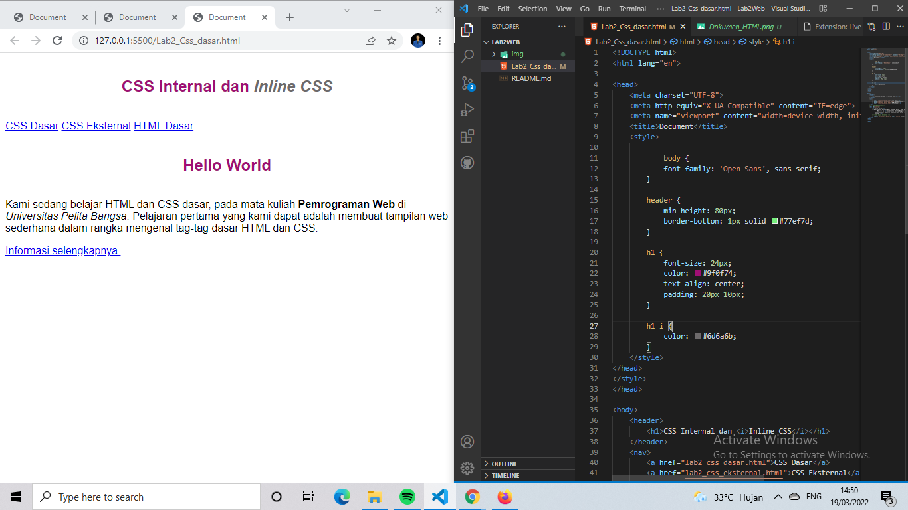
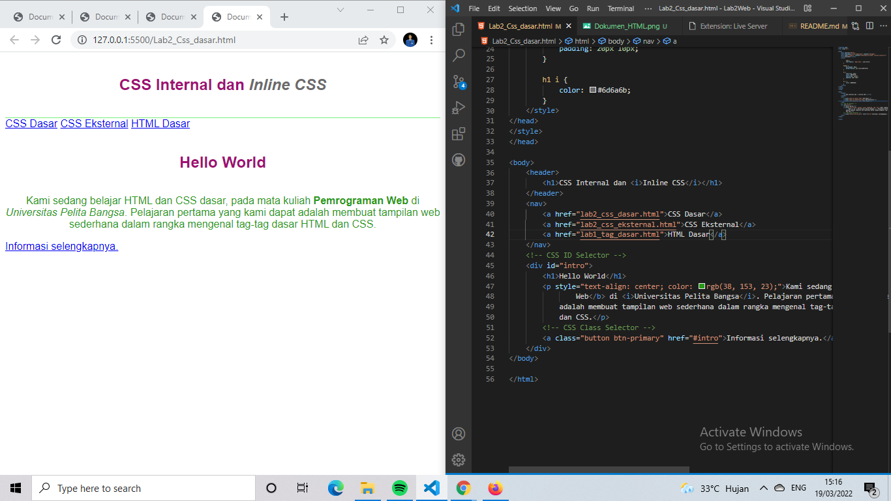
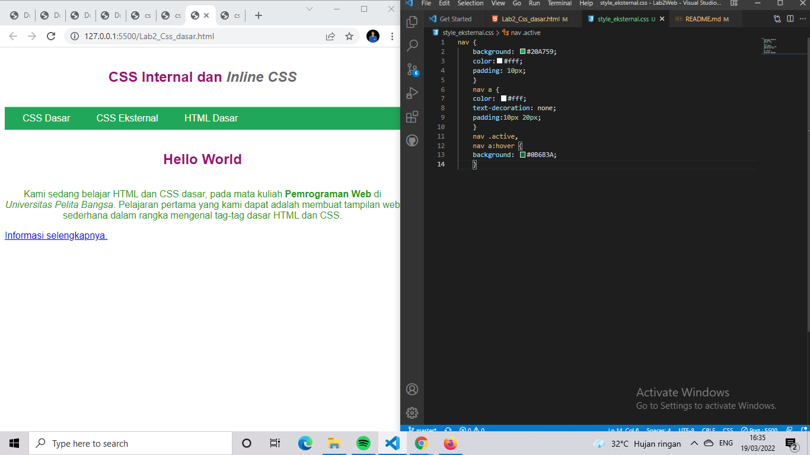
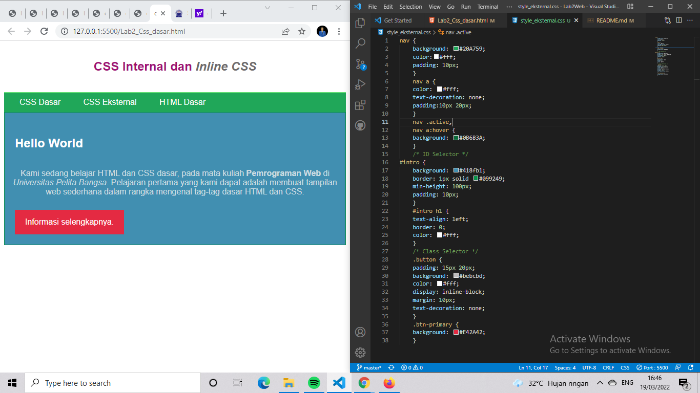

|Reza Tariki Taser | 312010265 |
|------------------|-----------|
| program web      | TI.20.A2  |

### PERTEMUAN 3

# LAB2WEB

## 1). MEMBUAT DOKUMEN HTML

Disini adalah sebuah dokumen namun belun terdapat file css internal, inline dan eksternal karena sebuah file html saja dan belum diberikan sebuah gaya pada css.

## 2). MENAMBAHKAN  CSS INTERNAL

css internal adalah yang filenya terdapat di dalam dokumen html dengan deklarasi style tepat di dalam head pada html.

## 3). MENAMBAHKAN INLINE CSS

css inline adalah css yang memiliki prioritas yang terkuat dibanding internal dan eksternal.

## 4). MENAMBAHKAN CSS EKSTERNAL

CSS Eksternal adalah CSS yang file nya terdapat diluar file HTML dan diberi tautan link di dalam HTML agar terhubung dengan CSS dan merubah gaya dengan eksternal file eksternal CSS dapat digunakan banyak HTML itu lah keunggulan dari CSS **EKSTERNAL** .

## CONTOH CODE DAN HASIL BROWSER NYA 

## 5). MENAMBAHKAN CSS SELECTOR

CSS selector adalah CSS yang pendeklarasian nya unik,seperti contoh jika **ID** yaitu dengan menggunakan **#** sedangkan **CLASS** menggunakan **.** dan hanya pada bagian yang diberi **ID** dan **CLASS** saja yang akan berubah di File HTML nya ketika diberi gaya pada CSS.

## CONTOH CODE DAN HANSIL NYA

